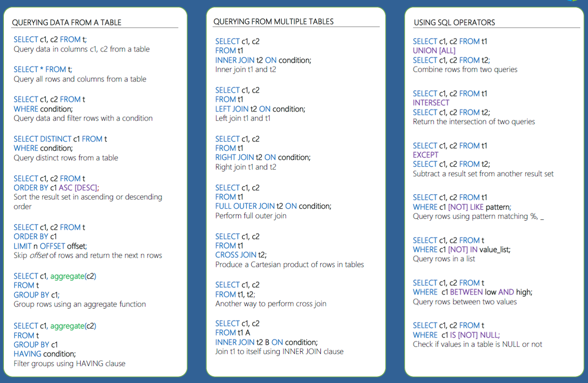
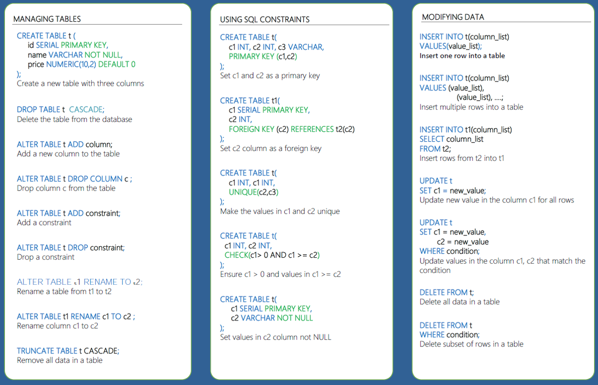
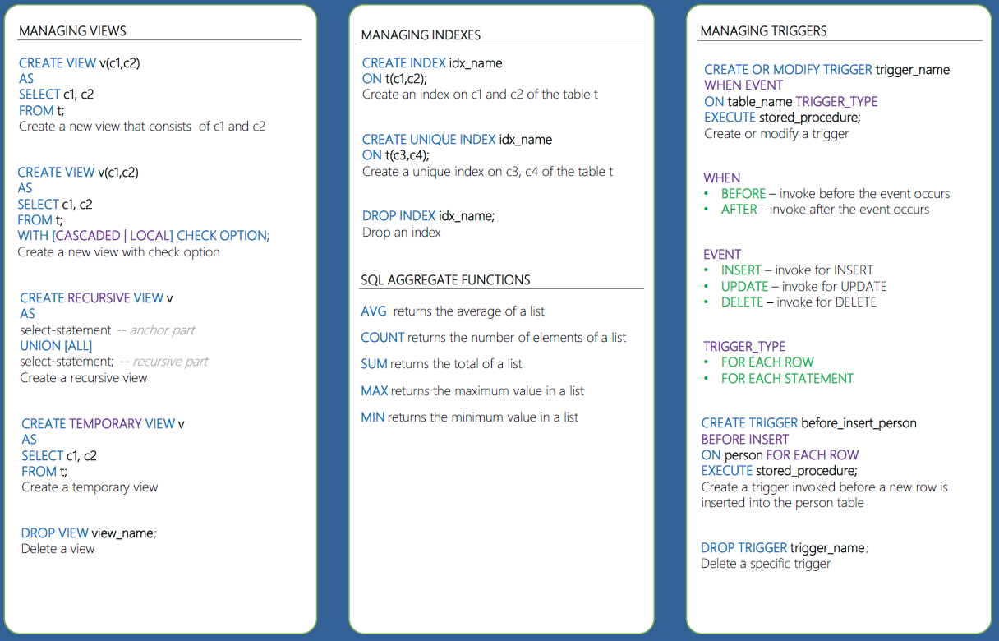

## PostgreSQL
One of the most popular sql dbs.

### Connection and psql usage
In order to connect to the sql server:
```
psql -U postgres
```
In order to connect to use an specific db (most of the times is postgres)
```
\c postgres
```
In order to see tables: 
```
\dt
```
To export a db
```
pg_dump -U postgres postgres > dbexport.pgsql
```
To import a db:
```
psql -U postgres postgres < dbexport.pgsql
```

### PostgreSQL in Docker
In order to get the image from the docker hub:
```
sudo docker pull postgres
```

Run it with:
```
sudo run --name "postgres-example" -e POSTGRES_PASSWORD="mysecurepassword" -v /var/lib/postgresql/data:/var/lib/postgresql/data -p 5432:5432 -d postgres
```

- In case using wsl: the ip connection should be the wsl ip: hostname -I
- In case using linux: the ip connection should be the container ip:
```
sudo docker exec -it postgres-example bash
hostname -I
```

### Common sql commands:




